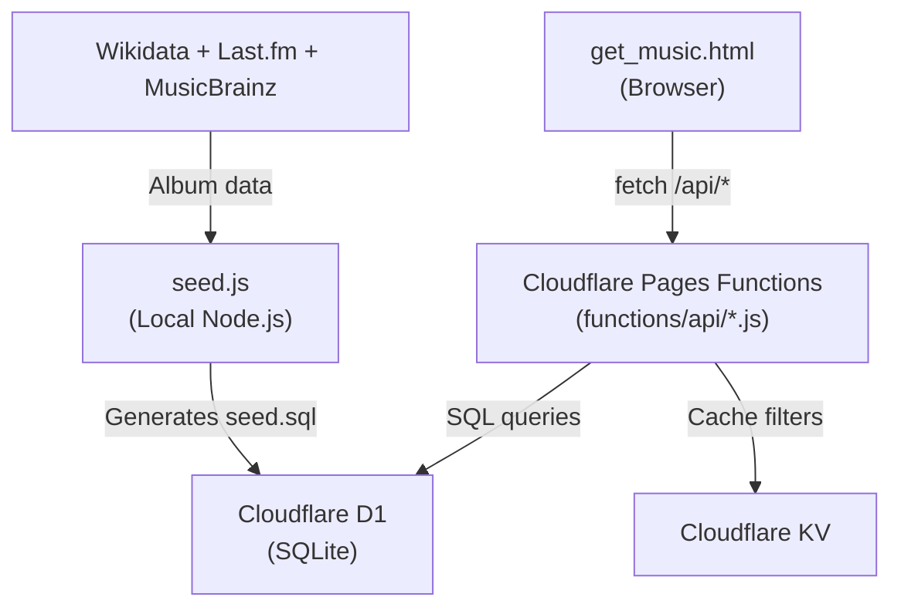

# World Album Discovery — Architecture & Walkthrough

## 🌍 What Is It?
A museum-curator-style music explorer that surfaces culturally diverse, historically important albums from around the world. It bypasses modern algorithms and taste profiling, allowing users to discover Japanese city pop, Pakistani qawwali, or Brazilian jazz through pure randomness, geography, and curation.

## 🏗 Architecture Summary

The feature is built within the existing portfolio site repository but operates with its own dedicated backend infrastructure using Cloudflare Pages, Functions, D1, and KV.



---

## 📂 What Was Built

### 1. Infrastructure
| File | Purpose |
|------|---------|
| `wrangler.toml` | Cloudflare Pages config with D1 (Database) + KV (Cache) bindings. |
| `schema.sql` | Fully normalized D1 database schema: `countries`, `artists`, `albums`, `genres`, `users`, and junction tables. |

### 2. Backend — 9 API Routes (Cloudflare Pages Functions)
Located in `functions/api/`, these are automatically routed by Cloudflare.
| File | Route | Purpose |
|------|-------|---------|
| `user.js` | `POST /api/user` | Create or login user by username. |
| `history.js` | `GET /api/history` | Fetch liked/disliked/skipped albums for a user. |
| `interact.js`| `POST /api/interact` | Record a like/dislike/skip interaction. |
| `daily.js` | `GET /api/daily` | Returns a daily album (deterministic, same for all users). |
| `discover.js`| `GET /api/discover` | Filtered random discovery based on user parameters. |
| `world-tour.js`| `GET /api/world-tour`| Country rotation passport mode. |
| `hidden-gem.js`| `GET /api/hidden-gem`| Returns high-rating, low-popularity albums. |
| `filters.js` | `GET /api/filters` | Available countries/genres/decades for dropdowns (Cached in KV). |
| `stats.js` | `GET /api/stats` | Cultural passport statistics for the dashboard. |

### 3. Frontend — The Music App (SPA)
| File | Purpose |
|------|---------|
| `get_music.html` | Entry point with 3 views (onboarding, dashboard, session). |
| `get_music.css` | Styles matching portfolio aesthetic (black, coral, dot-grid, minimal). |
| `get_music.js` | SPA logic: state machine, API client, rendering, localStorage persistence. |

### 4. Data Curation Pipeline
| File | Purpose |
|------|---------|
| `seed/getArtists.py` | Extracts musicians by country from Wikidata via SPARQL, saving them locally. |
| `seed/seed.js` | Reads Wikidata exports, validates with Last.fm (strictly filtering by `MIN_LISTENERS` to reject actors), queries MusicBrainz for album data, and outputs `seed.sql`. |

---

## 🚀 How to Run & Deploy

> [!IMPORTANT]
> The code is complete but the Cloudflare infrastructure needs to be connected for the backend to function.

### Step-by-step Setup:

```bash
# 1. Install wrangler and login
npm install -g wrangler
wrangler login

# 2. Create Cloudflare Pages project
#    Dashboard → Workers & Pages → Create → Pages → Connect to Git
#    Select your repo. Build output directory: /

# 3. Create D1 database
npx wrangler d1 create world-album-db
# → Copy the database_id into wrangler.toml

# 4. Create KV namespace  
npx wrangler kv namespace create CACHE
# → Copy the id into wrangler.toml

# 5. Apply database schema
npx wrangler d1 execute world-album-db --remote --file=schema.sql

# 6. Run seed script (generates seed.sql via data pipeline)
cd seed && node seed.js && cd ..

# 7. Load seed data into production
npx wrangler d1 execute world-album-db --remote --file=seed/seed.sql

# 8. Test locally
npx wrangler pages dev .

# 9. Open http://localhost:8788/get_music.html
```

### After Cloudflare Pages is connected:
- Every `git push` auto-deploys the entire site.
- Your portfolio (`index.html`) continues working as before.
- The music app lives at `yourdomain.com/get_music.html`.
